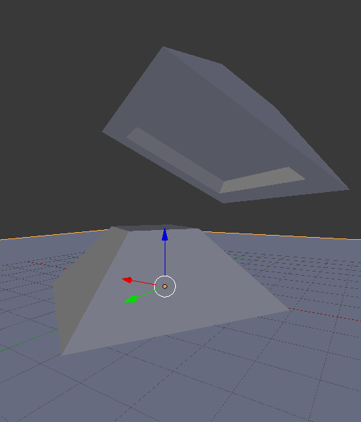

# partleveler
A script to settle a directory STL files (of arbitrary shape) using Blender physics, probably reducing the volume of support structure needed.

The part will settle to about what you'd expect it to look like if it was placed on a table.

It works particularly well for planar things (see below before/after screenshot).

usage:
blender -b -P \<path to part_leveler.py\> -- \<path to folder to iterate over\>

The dashes are important, it indicates to blender to ignore past there and let the python script handle that input instead.

Comment out lines labeled unix or windows (lines 33/34 and lines 44/45) to toggle between directory styles.

Let me know if this is useful for you. I originally figured out this process for ridiculously wasteful wax-support style printers that don't even care if your part is touching the print bed. 

